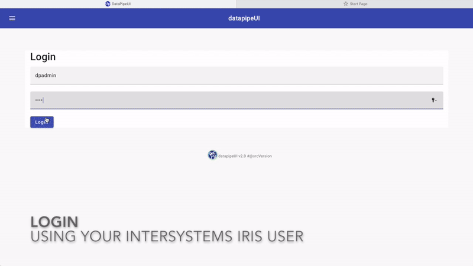
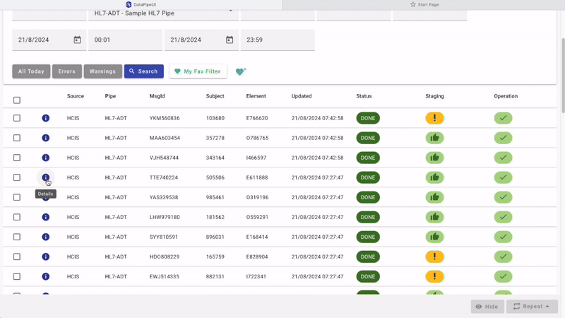

**DataPipeUI** is a user interface [iris-datapipe](https://github.com/intersystems-ib/iris-datapipe), an interoperability framework to ingest data in InterSystems IRIS in a flexible way.

# QuickStart

- Be sure you have [iris-datapipe](https://github.com/intersystems-ib/iris-datapipe) running.
- After that, you can run the UI container:

```
docker-compose up -d
```

- Access the UI at http://localhost:8080/ and log-in using your InterSystems IRIS credentials.




# Features

DataPipeUI provides a comprehensive interface to monitor and manage your data ingestion pipelines:

## Inbox Management

- **Real-time monitoring** of incoming data through a searchable inbox interface
- **Multi-stage tracking** from Ingestion → Staging → Operation with detailed status information
- **Batch operations** to repeat or ignore multiple inbox items
- **Advanced filtering** by source, pipe, status, dates, and custom criteria
- **Session tracing** integration with InterSystems IRIS Interoperability for debugging

## Dashboard & Analytics

- **Activity charts** using ApexCharts to visualize pipeline activity
- **Pipeline statistics** showing throughput and error rates
- **Interactive visualizations** for identifying bottlenecks

## Data Catalog

- **Hierarchical entities** with category-based to show total registries available
- **Interactive tree navigation** Easy navigation
- **Real-time statistics** showing total record counts
- **Histogram visualizations** displaying data distribution over time
- **Multi-level filtering** by category with visual feedback
- **Search functionality** across entities, descriptions, and table metadata
- **Table schema viewer** showing column definitions, data types, and constraints
- **MDX query management** for totals and histograms with error tracking
- **Entity metadata** including data origins, usage documentation, and namespace information
- **Inline editing** of catalog entities with hierarchical parent-child relationships
- **Responsive design** optimized for desktop and mobile devices

## Pipe Administration

- **Pipe configuration** management (admin only)
- **CRUD operations** for creating, editing, and managing data pipes
- **Pipeline monitoring** with detailed execution logs

## User Experience

- **Authentication** using HTTP Auth with InterSystems IRIS
- **User preferences** stored locally for personalized experience
- **Responsive Material Design** interface built with Angular Material
- **Alert notifications** for important events and errors
- **Spanish locale support** for date and number formatting

# Configuration

Set up environment files so you can reach you [iris-datapipe](https://github.com/intersystems-ib/iris-datapipe) instance.

- [environment.ts](./src/environments/environment.ts) - non production environment
- [environment.prod.ts](./src/environments/environment.ts) - production environment

Want to contribute to this project? See [CONTRIB.md](./CONTRIB.md)
