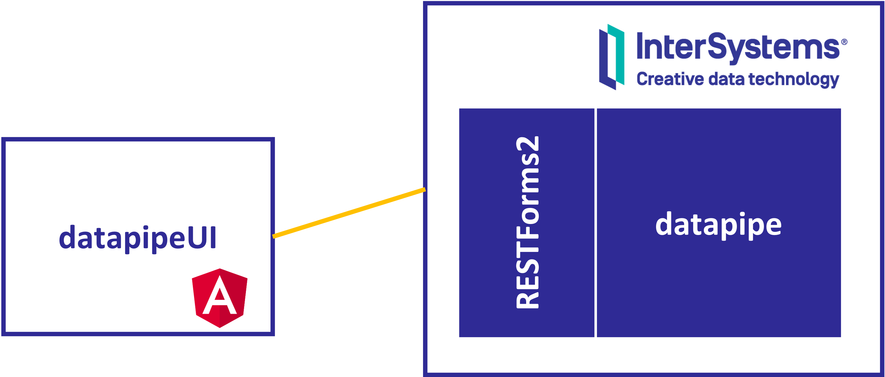

**DataPipeUI** is a user interface [iris-datapipe](https://github.com/intersystems-ib/iris-datapipe), an interoperability framework to ingest data in InterSystems IRIS in a flexible way.



# QuickStart
* Be sure you have [iris-datapipe](https://github.com/intersystems-ib/iris-datapipe) running.
* After that, you can run the UI container:
```
docker-compose up -d
```
* Access the UI at http://localhost:8080/ and log-in using your InterSystems IRIS credentials.


# Configuration
Set up environment files so you can reach you [iris-datapipe](https://github.com/intersystems-ib/iris-datapipe) instance.
* [environment.ts](./src/environments/environment.ts) - non production environment
* [environment.prod.ts](./src/environments/environment.ts) - production environment

Want to contribute to this project? See [CONTRIB.md](./CONTRIB.md)
